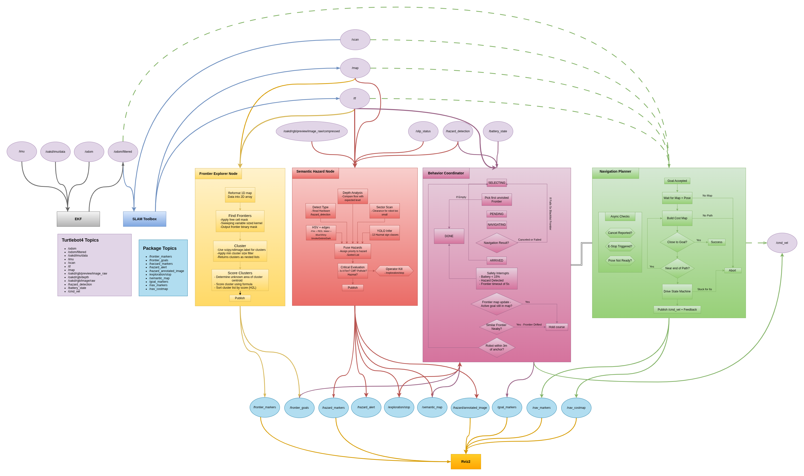
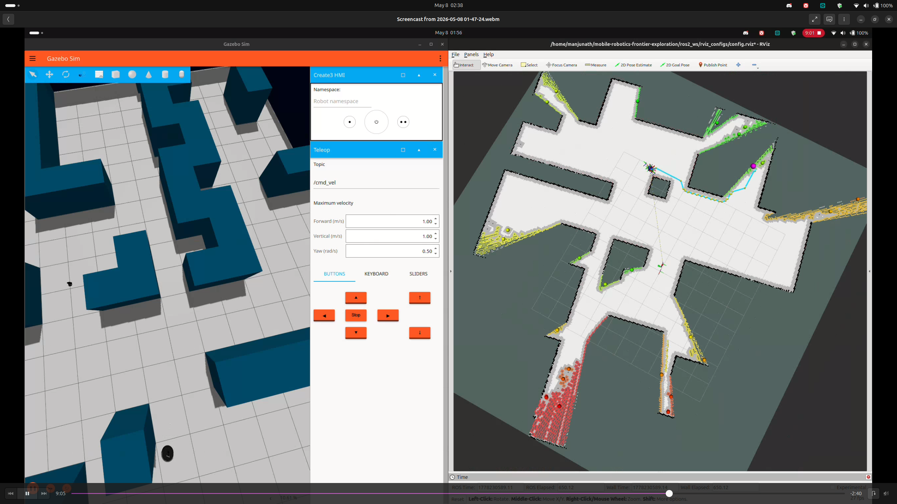
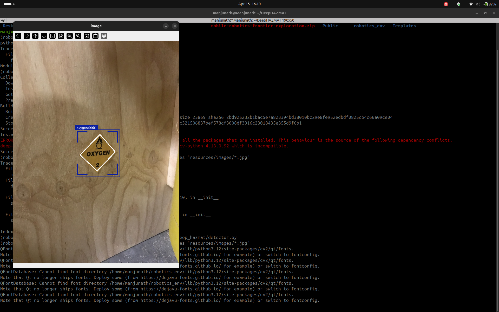
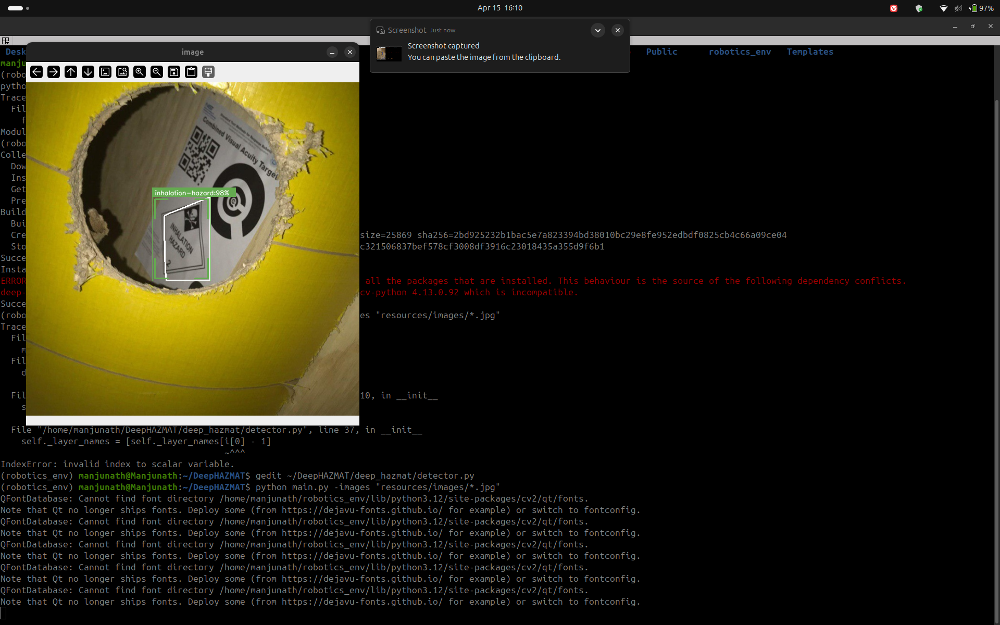
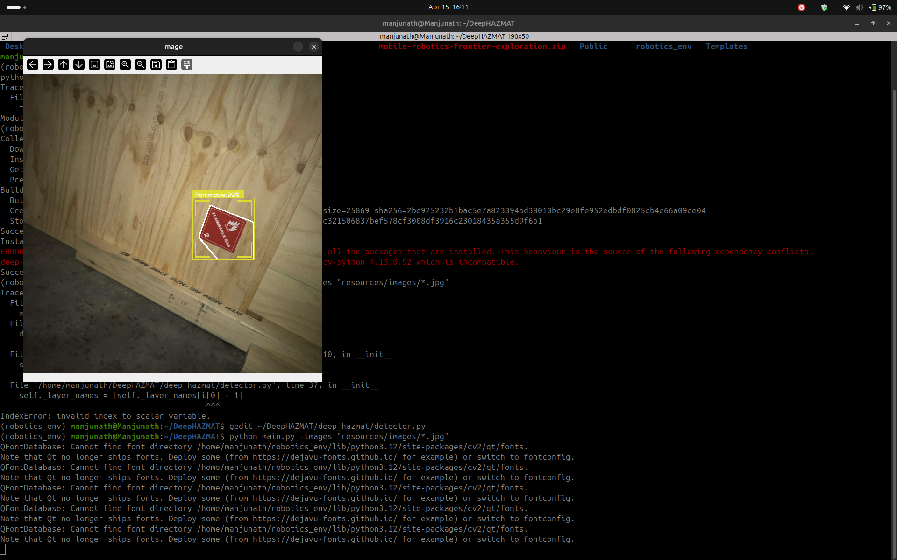

# Autonomous Frontier Exploration with Semantic Hazard Detection

**RAS 598 — Mobile Robotics | Arizona State University | Spring 2026**  
**Team:** Princess Colon · Manjunath Kondamu · Rohit Mane

---

## What This Is

Final project for RAS 598. A TurtleBot4 that autonomously explores an unknown environment, builds a map using SLAM, and detects hazardous materials along the way — no human input after launch.

The robot starts with zero knowledge of the space, figures out where the unexplored areas are, navigates to them one by one, and marks any hazard signs it detects on the map. When there is nothing left to explore, it stops on its own.

Tested in both Gazebo simulation and on real TurtleBot4 hardware.

---

## System Architecture




Five ROS2 nodes running together:

```
SLAM (slam_toolbox)
    ↓ /map
Frontier Explorer       — finds boundaries between mapped and unknown space
    ↓ /frontier_goals
Behavior Coordinator    — picks which frontier to go to next
    ↓ /navigate_to_pose
Navigation Planner      — builds costmap, runs A*, drives the robot

Semantic Hazard Classifier  — camera → YOLO → hazard location on map (parallel)
```

---

## Demos

**Autonomous exploration in Gazebo — map building in real time:**



**Hazard detection — DeepHAZMAT identifying real signs:**





Full video demos in `assets/videos/`:
- `Exploration_Demo.mp4` — complete autonomous run
- `Frontier_Explorer_Node_Demo.mp4` — frontier detection visualised in RViz
- `Hazard_Marker_Demo.mp4` — hazard detection with map markers

---

## What Each Part Does

**Frontier Explorer** reads the SLAM occupancy grid on every update. A frontier is any free cell touching an unknown cell. It clusters these, scores them by distance from the robot (nearest first), and publishes the ranked list.

**Behavior Coordinator** picks the top unvisited frontier and sends it as a navigation goal. Handles failures — after 5 failed attempts a frontier gets blacklisted. Uses hysteresis to avoid cancelling mid-navigation when a frontier disappears because the robot got close enough to map it.

**Navigation Planner** is a custom navigator written from scratch. Builds a costmap with wall inflation (free / soft zone / hard zone / wall tiers), runs A* on it, prunes the path using corridor checks that account for the robot's physical width, then drives through waypoints with a proportional controller at 20Hz.

**Semantic Hazard Classifier** stacks three detection layers — DeepHAZMAT for 13 UN hazard classes, YOLOv5 for fire, and LiDAR sector analysis for spatial confirmation. When a detection fires, it does a retroactive TF lookup using the camera frame's capture timestamp to place a persistent marker at the actual hazard location on the map.

> **Note:** Hazard detection works when the camera is facing the sign directly. On the real robot, an OAK-D driver initialisation issue prevented the image stream from connecting reliably — the hazard classifier ran cleanly in simulation.

---

## Hardware

- TurtleBot4 (iRobot Create 3 base)
- RPLiDAR A1
- OAK-D Camera
- ROS2 Humble on Ubuntu 22.04

---

## Setup

```bash
git clone git@github.com:Mkondamu/mobile-robotics-frontier-exploration.git
cd mobile-robotics-frontier-exploration/ros2_ws
colcon build --symlink-install
```

Source in every new terminal:
```bash
source open_ros_env.sh
```

Launch:
```bash
ros2 launch frontier_exploration_mapping exploration.launch.py
```

For simulation: add `use_sim_time:=true`
To skip RViz: add `use_rviz:=false`

---

## Project Website

Full milestone reports, math documentation, architecture diagrams, and demos:
👉 https://pricolon.github.io/mobile-robotics-frontier-exploration/

---

## Team Contributions

**Princess Colon** — Navigation stack. Built the A* planner, costmap builder, frontier explorer with wavefront scoring, and behavior coordinator FSM from scratch.

**Manjunath Kondamu** — Perception and website. Integrated DeepHAZMAT and YOLOv5 fire detection into the semantic hazard classifier node, added LiDAR sector analysis, implemented retroactive TF localization for hazard map markers, fixed the Gazebo LiDAR bug (Ogre2 renderer issue), tuned frontier scoring and navigation parameters for real hardware, and built the project website across all three milestones.

**Rohit Mane** — Documentation. Mathematical derivations and ethical impact analysis.

---

## Third-Party Libraries

**DeepHAZMAT** — YOLO-based detector trained on 13 UN hazardous material classes. Integrated into the semantic hazard classifier.
→ https://github.com/mrl-amrl/DeepHAZMAT

**YOLOv5 Fire Detection** — Fine-tuned YOLOv5 for fire detection.
→ https://github.com/spacewalk01/yolov5-fire-detection

---

## Course

RAS 598 — Mobile Robotics · Arizona State University · Spring 2026 · Group 1
