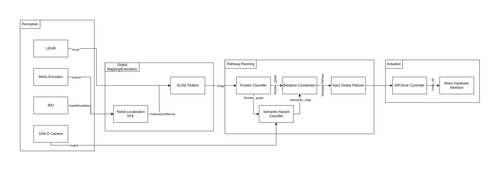

# Autonomous Frontier Exploration with Semantic Hazard Mapping

**Course:** Mobile Robotics — Arizona State University, Spring 2026  
<<<<<<< HEAD
**Team:** Princess Colon · Manjunath Kondamu · Rohit Mane  
=======

**Team:** Rohit Mane · Princess Colon · Manjunath Kondamu  

>>>>>>> 65a563d37b49d2dfb4add64a295fa62436d6f955
**Repository:** [https://github.com/PriColon/mobile-robotics-frontier-exploration](https://github.com/PriColon/mobile-robotics-frontier-exploration)

---

## Mission Statement & Scope

Our robot is designed to autonomously explore a completely unknown indoor environment — such as a lab corridor or multi-room office space — without any prior map, human guidance, or pre-programmed paths. As it explores, it builds a live occupancy map and semantically classifies regions of the environment as clear, cluttered, or hazardous using its onboard RGB-D camera.

**The problem being solved:** Standard mobile robot deployments require a pre-built map before autonomous navigation is possible. This creates a chicken-and-egg problem in unknown or dynamically changed environments. Our system solves this by combining frontier-based exploration with semantic awareness, enabling the robot to build, classify, and navigate its environment simultaneously from scratch.

**Target Environment:** Static indoor environment — lab corridors, office rooms, and interconnected hallways. The environment contains furniture, walls, doorways, and open floor space. All obstacles are assumed static during a single exploration run.

**Success State:** The robot successfully explores at least 80% of the reachable floor area within a bounded environment, terminates exploration gracefully when no new frontiers exist, and produces a final labeled occupancy grid map distinguishing clear, cluttered, and hazardous zones — all without any human intervention after launch.

---

## Technical Specifications

**Robot Platform:** TurtleBot4 Lite — iRobot Create3 base with Raspberry Pi 4 (4GB) compute board

**Kinematic Model:** Differential Drive — two independently driven wheels with a passive caster. The robot turns by varying the relative speed of the left and right wheels. This model is described by:

```
v = (v_r + v_l) / 2         (linear velocity)
ω = (v_r - v_l) / L         (angular velocity, L = wheelbase)
```

**Perception Stack:**

| Sensor | Model | ROS2 Topic | Purpose |
|---|---|---|---|
| 2D LiDAR | RPLIDAR A1M8 | `/scan` | SLAM map building, obstacle detection |
| RGB-D Camera | Luxonis OAK-D | `/oakd/rgb/preview/image_raw` | Semantic region classification |
| Stereo Depth | OAK-D stereo pair | `/oakd/stereo/image_raw` | Depth-based hazard detection |
| IMU (Create3) | Built-in ICM-42670 | `/imu` | Orientation, EKF fusion |
| IMU (OAK-D) | Built-in IMU | `/oakd/imu/data` | Secondary orientation source |
| Wheel Encoders | Create3 built-in | `/odom` | Primary distance measurement |

---

## High-Level System Architecture

The system follows the **Perception -> Estimation -> Planning -> Actuation** pipeline. A reactive bypass allows the behavior coordinator to receive direct semantic feedback from the perception layer, enabling hazard-aware goal selection independently of map update speed.

<<<<<<< HEAD

=======


>>>>>>> 65a563d37b49d2dfb4add64a295fa62436d6f955

---

## Module Declaration Table

| Module / Node | Functional Domain | Software Type | Description |
|---|---|---|---|
| LiDAR Driver (`rplidar_ros2`) | Perception | Library | Publishes raw 2D scan data |
| OAK-D Camera Driver (`depthai_ros`) | Perception | Library | Publishes RGB and stereo depth streams |
| SLAM Toolbox | Estimation | Library | Builds 2D occupancy grid map |
| Robot Localization EKF | Estimation | Library | Fuses wheel odometry and IMU data |
| Frontier Explorer Node | Planning | **Custom** | Detects frontier cells and scores by information gain |
| Semantic Hazard Classifier | Planning | **Custom** | Classifies camera regions as clear, cluttered, or hazardous |
| Behavior Coordinator | Planning | **Custom** | State machine managing exploration decisions |
| Nav2 Global Planner | Planning | Library | Calculates collision-free path to navigation goal |
| Diff-Drive Controller | Actuation | Library | Translates velocity commands to wheel speeds |

---

## Module Intent

### Library Modules

**SLAM Toolbox**  
We will use `slam_toolbox` in asynchronous mode (`async_slam_toolbox_node`) to generate a live 2D occupancy grid from the RPLIDAR scan data. The key configuration parameters we will tune are: `resolution` (0.05m per cell — balancing detail with computational cost), `minimum_travel_distance` and `minimum_travel_heading` (controlling how frequently the map updates to prevent overloading the Pi), and `scan_buffer_maximum_scan_queue_size` to manage the LiDAR scan rate. SLAM Toolbox was chosen over RTAB-Map for 2D environments because it has lower CPU overhead, which is important given the Raspberry Pi 4's constraints, and its map-saving and map-loading features directly support our re-localization needs.

**Robot Localization EKF**  
We will use the `robot_localization` package to implement an Extended Kalman Filter that fuses wheel encoder odometry (`/odom` at 20Hz) with the Create3's built-in IMU (`/imu` at 100Hz) and the OAK-D's secondary IMU (`/oakd/imu/data`). This is necessary because wheel encoders alone drift over time — particularly on smooth lab floors where minor slippage accumulates into significant positional error. We will configure the EKF in 2D mode (estimating x, y, yaw only) and tune the per-sensor covariance matrices so that the IMU dominates orientation estimation while odometry dominates position. The output `/odometry/filtered` topic provides SLAM Toolbox with a stable `odom → base_link` transform.

**Nav2 Global Planner**  
Nav2 will be used for local path planning and obstacle avoidance once our Behavior Coordinator selects a frontier navigation goal. We will tune the costmap `inflation_radius` (0.3m — one robot diameter) to ensure safe clearance from walls, and configure the `DWBLocalPlanner` with reduced `max_vel_x` (0.2 m/s) appropriate for indoor exploration where the robot encounters unexpected furniture and doorways. Nav2 was chosen because it integrates directly with the occupancy grid output from SLAM Toolbox and provides robust recovery behaviors when the robot gets stuck.

**Diff-Drive Controller / Create3 Hardware Interface**  
The Create3 base directly consumes `geometry_msgs/Twist` messages on `/cmd_vel`, making the hardware interface transparent to ROS2. No custom firmware is required. We will configure velocity and acceleration limits through Nav2's controller parameters (`max_vel_x: 0.22`, `max_vel_theta: 1.0`, `acc_lim_x: 0.5`) to match the Create3's physical capabilities.

---

### Custom Modules

**Frontier Explorer Node**  
This node implements a frontier-based exploration algorithm from scratch, based on the foundational work of Yamauchi (1997) extended with information-theoretic goal scoring. The node subscribes to `/map` (the live `nav_msgs/OccupancyGrid` from SLAM Toolbox) and processes the grid to identify frontier cells — free cells (value 0) that are adjacent to at least one unknown cell (value -1). It uses connected-component labeling via `scipy.ndimage` to cluster individual frontier cells into contiguous frontier regions, filtering out clusters smaller than a configurable minimum size to remove noise.

Each frontier region is then scored using an information-gain function:

```
score(R) = (α × size(R) + β × unknown_near(R)) / (dist(R) + ε)
```

where `size(R)` is the cluster cell count, `unknown_near(R)` counts unknown cells within a configurable radius of the region centroid, `dist(R)` is the Euclidean distance from the robot's current pose, and `α`, `β`, `ε` are tunable parameters. The node publishes a ranked `geometry_msgs/PoseArray` to `/frontier_goals` and corresponding `visualization_msgs/MarkerArray` to `/frontier_markers` for live RViz2 inspection. This constitutes the primary custom algorithmic contribution of the project.

**Semantic Hazard Classifier**  
This node processes the OAK-D camera feed to classify regions of the environment into three semantic categories: CLEAR (open passable space), CLUTTERED (moderate obstacle density), and HAZARD (dense obstacles, transparent surfaces, or potential drop-offs). The classification uses both the RGB stream and the stereo depth map. Each incoming frame is divided into a spatial grid of patches. For each patch, we compute: edge density via Canny detection on the grayscale RGB image, mean depth and depth variance from the stereo image, and the ratio of NaN depth values (indicating transparent or reflective surfaces). These features feed a rule-based classifier tuned on labeled lab images collected during Week 1. The node publishes a coarse `nav_msgs/OccupancyGrid` representing the semantic labeling of the camera's field of view to `/semantic_map`.

**Behavior Coordinator**  
This node implements the state machine that governs all exploration decisions. It defines five states: IDLE, SELECTING, NAVIGATING, ARRIVED, and DONE. It subscribes to `/frontier_goals`, `/semantic_map`, and `/battery_state`, and uses the Nav2 `NavigateToPose` action client to dispatch goals. The coordinator filters frontier candidates against the current semantic map — skipping any frontier whose location overlaps a known HAZARD zone. It also maintains a visited-frontiers set to prevent the robot from re-navigating to already-explored locations. If no valid frontier remains, the state machine transitions to DONE and publishes a final exploration status. This node also implements all safety timeout and deadman switch logic described in the Safety section below.

---

## Safety & Operational Protocol

**Deadman Switch — Communication Timeout:**  
The Behavior Coordinator monitors the timestamp of the last received `/frontier_goals` message. If no update is received for more than **5 seconds**, the node publishes a zero-velocity `Twist` message directly to `/cmd_vel` and transitions to the IDLE state. This protects against silent failures in the Frontier Explorer node (e.g., if the map stops updating) that could leave the robot executing a stale navigation goal indefinitely.

**E-Stop Trigger Conditions:**  
The system triggers an immediate full stop under the following conditions:

1. **Battery threshold:** If `/battery_state.percentage` drops below 15%, the coordinator cancels all active navigation goals, publishes zero velocity, and transitions to DONE.
2. **Create3 hazard detection:** The Create3 base publishes bump and cliff detection events on `/hazard_detection`. We subscribe to this topic and immediately cancel navigation if any bump or cliff hazard is reported.
3. **Nav2 repeated failure:** If Nav2 rejects or fails the same goal three times in succession, the coordinator marks that frontier as unreachable and selects the next candidate. If all frontiers are exhausted through failure, the system halts.
4. **Operator kill command:** A ROS2 topic `/exploration/stop` (type `std_msgs/Bool`) is monitored continuously. Publishing `true` to this topic from any terminal on the network immediately stops all motion and gracefully shuts down the exploration stack.

**Physical Safety Protocol:**  
During all real-robot tests, one team member must remain physically present within arm's reach of the Create3's power button. The robot will not be operated in spaces containing people other than the test team. Maximum configured velocity is 0.2 m/s (well below the Create3's 0.46 m/s maximum) for all indoor exploration runs.

---
## Pipeline Logic Implementations and Callback Flow

**1. Box Filter (Pass-through Filter)**
Removes points outside a 3D workspace box.

**CODE**

def box_filter(self, pts, colors):

    mask = np.all((pts >= self.cfg.box_min) & (pts <= self.cfg.box_max), axis=1)

    filtered_pts = pts[mask]
    filtered_colors = colors[mask]

    return filtered_pts, filtered_colors

**Explanation**
Keeping the points satisfying:
𝑏𝑜𝑥_𝑚𝑖𝑛 ≤ (𝑥,𝑦,𝑧) ≤ 𝑏𝑜𝑥_𝑚𝑎𝑥
box_min≤(x,y,z)≤box_max
Vectorized comparison avoids loops.

**2. Voxel Downsampling**
Reduces cloud density.

**Idea:**
Convert points to voxel indices then keep one point per voxel.

**CODE**

def downsample(self, pts, colors):

    voxel = self.cfg.voxel_size

    voxel_idx = np.floor(pts / voxel).astype(np.int32)
    
    unique_voxels, unique_indices = np.unique(voxel_idx, axis=0, return_index=True)
    
    return pts[unique_indices], colors[unique_indices]

**Explanation**
Voxel coordinate:

𝑣 = ⌊ 𝑝/𝑣𝑜𝑥𝑒𝑙_𝑠𝑖𝑧𝑒 ⌋
v=⌊ p/voxel_size ⌋

np.unique ensures one point per voxel.

**3. Normal Estimation using SVD**

*Steps*
1. Find k neighbors
2. Center neighbors
3. Compute SVD
4. Smallest singular vector = normal

**CODE**

def estimate_normals(self, pts, k=15):
    
    idxs = self.get_neighbors(pts, pts, k)
    
    normals = np.zeros_like(pts)
    
    for i in range(len(pts)):
    
        neighbors = pts[idxs[i]]
        
        centered = neighbors - neighbors.mean(axis=0)
        
        U, S, Vt = np.linalg.svd(centered)
        
        normal = Vt[-1]
        
        normals[i] = normal / np.linalg.norm(normal)
    
    return normals

*Mathematically*
SVD decomposition:

𝑋 = 𝑈Σ𝑉^𝑇
X=UΣV^T

Smallest eigenvector of covariance = surface normal.

**4. Plane RANSAC (Floor Removal)**

*Plane equation*
𝑎𝑥 + 𝑏𝑦 + 𝑐𝑧 + 𝑑 = 0
ax+by+cz+d=0

*Distance from point to plane:*
𝑑 = ∣ 𝑎𝑥 + 𝑏𝑦 + 𝑐𝑧 + 𝑑∣ / sqrt (𝑎^2 + 𝑏^2 + 𝑐^2
d = ∣ax+by+cz+d∣ / sqrt (a^2+b^2+c^2)

*Implementation:*

def find_plane_ransac(self, pts, iters=100):

    best_inliers = []
    
    best_model = None
    
    N = len(pts)
    
    for _ in range(iters):
    
        sample_idx = np.random.choice(N, 3, replace=False)
        
        p1, p2, p3 = pts[sample_idx]
        
        v1 = p2 - p1
        
        v2 = p3 - p1
        
        normal = np.cross(v1, v2)
        
        if np.linalg.norm(normal) == 0:
        
            continue
        normal = normal / np.linalg.norm(normal)
        # Check alignment with expected floor normal
        if np.abs(np.dot(normal, self.cfg.target_normal)) < self.cfg.normal_thresh:
            continue
        
        d = -np.dot(normal, p1)
        distances = np.abs(pts @ normal + d)
        inliers = np.where(distances < self.cfg.floor_dist)[0]
        
        if len(inliers) > len(best_inliers):
            best_inliers = inliers
            best_model = (normal, d)
    
    return best_model, best_inliers

**5. Euclidean Clustering**

Cluster points based on spatial proximity.

def euclidean_clusters(self, pts, dist_thresh=0.1):
    
    tree = cKDTree(pts)
    
    visited = np.zeros(len(pts), dtype=bool)
    
    clusters = []
    
    for i in range(len(pts)):
        if visited[i]:
            continue
        queue = [i]
        cluster = []
    
        while queue:
            idx = queue.pop()
            if visited[idx]:
                continue
        
            visited[idx] = True
            cluster.append(idx)
            neighbors = tree.query_ball_point(pts[idx], dist_thresh)
            
            for n in neighbors:
                if not visited[n]:
                    queue.append(n)
        clusters.append(np.array(cluster))
    
    return clusters

**6. Cylinder RANSAC**

*Cylinder axis from normals:*

𝑎𝑥𝑖𝑠 = 𝑛1 × 𝑛2
axis= n1 × n2

*Distance from point to axis:*

𝑑=∥ (𝑝−𝑐) − ((𝑝−𝑐)⋅𝑎)𝑎∥
d=∥(p−c)−((p−c)⋅a)a∥

*Implementation:*

def find_single_cylinder(self, pts, normals, iters=300):

    best_inliers = []
    
    best_model = None
    
    N = len(pts)
    
    for _ in range(iters):
        idx = np.random.choice(N, 2, replace=False)
        p1, p2 = pts[idx]
        n1, n2 = normals[idx]
        axis = np.cross(n1, n2)
        if np.linalg.norm(axis) < 1e-6:
            continue
        axis = axis / np.linalg.norm(axis)
    
        # enforce vertical axis
        if np.abs(axis[1]) < 0.8:
            continue
        center = (p1 + p2) / 2
        v = pts - center
        proj = v @ axis
        closest = center + np.outer(proj, axis)
        dist = np.linalg.norm(pts - closest, axis=1)
        inliers = np.where(np.abs(dist - self.cfg.cyl_radius) < 0.02)[0]
        
        if len(inliers) > len(best_inliers):
            best_inliers = inliers
            best_model = (center, axis, self.cfg.cyl_radius)
    return best_model, best_inliers

**7. Color Classification (HSV)**
Example thresholds.

def classify_color(self, rgb):
    h, s, v = self.rgb_to_hsv(rgb[0], rgb[1], rgb[2])

    if h < 20 or h > 340:
        return "red"
    
    if 80 < h < 160:
        return "green"
    
    if 200 < h < 260:
        return "blue"
    
    if 300 < h < 340:
        return "pink"
    
    return "unknown"

**8. Complete Pipeline Flow (Callback)**

Replace TODO with:

pts_box, colors_box = self.pipeline.box_filter(pts, raw_colors)
pts_v, colors_v = self.pipeline.downsample(pts_box, colors_box)
normals = self.pipeline.estimate_normals(pts_v)
plane_model, plane_inliers = self.pipeline.find_plane_ransac(pts_v)
mask = np.ones(len(pts_v), dtype=bool)
mask[plane_inliers] = False
pts_objects = pts_v[mask]
colors_objects = colors_v[mask]
clusters = self.pipeline.euclidean_clusters(pts_objects)
detected_cylinders = []
for cluster in clusters:
    cluster_pts = pts_objects[cluster]
    cluster_colors = colors_objects[cluster]
    normals_cluster = self.pipeline.estimate_normals(cluster_pts)
    model, inliers = self.pipeline.find_single_cylinder(cluster_pts, normals_cluster)
    if model is None:
        continue
    avg_color = cluster_colors.mean(axis=0)
    label = self.pipeline.classify_color(avg_color)
    detected_cylinders.append((model, avg_color, label))

**9. Expected Output in RViz**

*You should see:*
• Floor removed point cloud
• Separate clusters
• Cylinders drawn using Marker.CYLINDER
• Correct color markers

*Example detected structure:*
Cylinder 1 → Green
Cylinder 2 → Red
Cylinder 3 → Blue

*Bonus bag:*
Pink cylinder detected

**10. RViz Topics to Visualize**

*Add these displays:*
/pipeline/stage0_box
/pipeline/stage3_candidates
/viz/detections

*Fixed Frame:*
oakd_rgb_camera_optical_frame

**11. Runtime Performance Tips**

*To keep 0.5x rosbag speed:*

• Use voxel_size = 0.02
• Limit RANSAC iterations
• Avoid Python loops except small ones
• Prefer NumPy broadcasting

---

## Git Infrastructure

**Team Repository:** [https://github.com/PriColon/mobile-robotics-frontier-exploration](https://github.com/PriColon/mobile-robotics-frontier-exploration)
*(All three teammates added as members with write access)*

**Individual Site Repository with Submodule:**  
Each team member's personal project site includes the shared repository as a Git submodule at `_projects/tb4-frontier-exploration`, linking individual documentation to the shared codebase per the course requirement.

**Branch Structure:**  
```
main              ← stable, tested code only
person-a/slam     ← Person A: perception + EKF configuration
person-b/nodes    ← Person B: frontier explorer + semantic classifier
person-c/coord    ← Person C: behavior coordinator + launch files
```


**README:** A `README.md` at the repository root mirrors this mission statement and contains setup and launch instructions.

---
